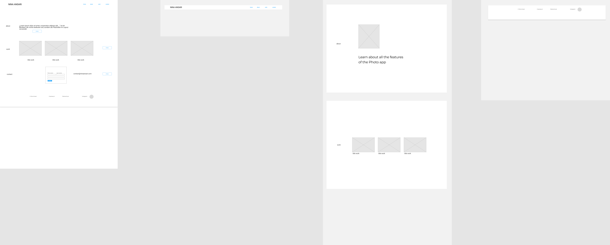
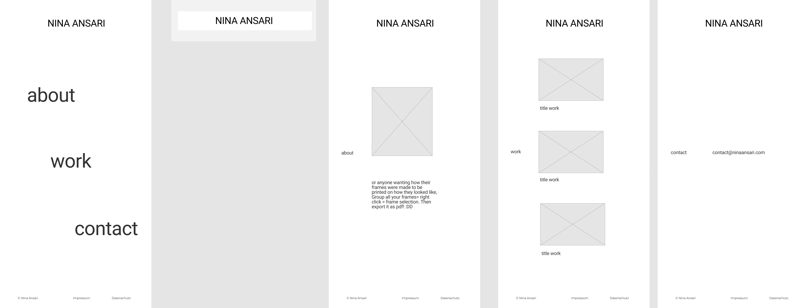
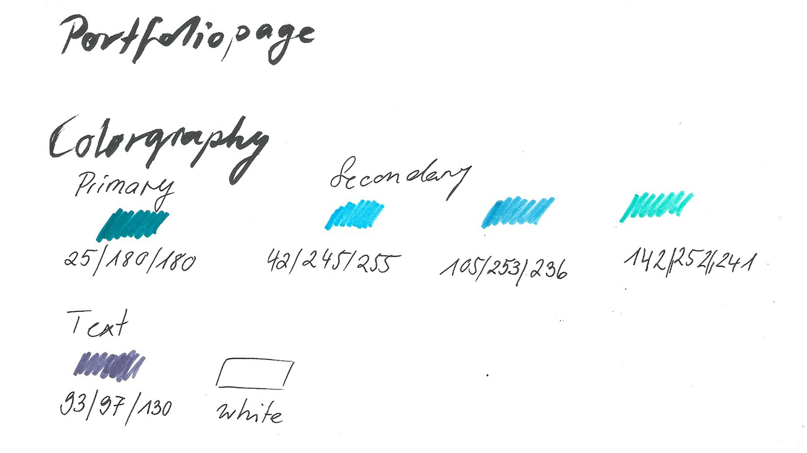
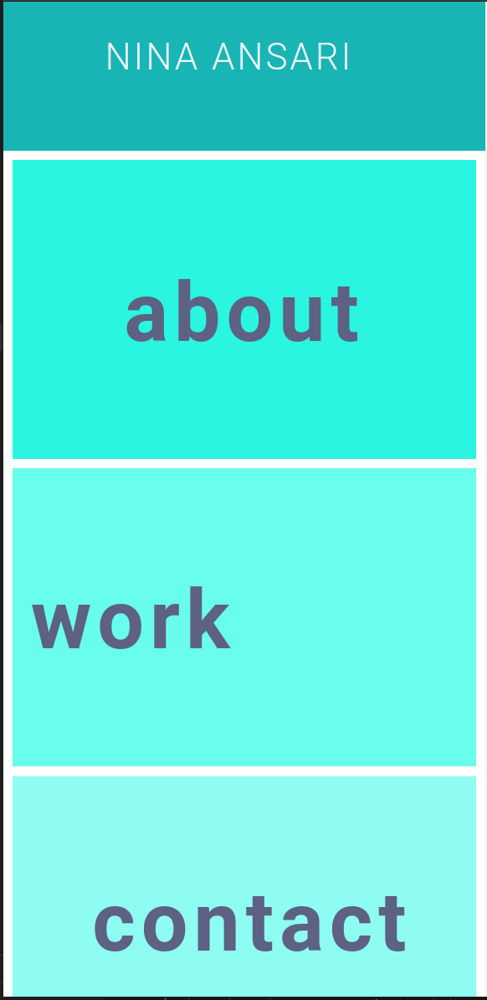
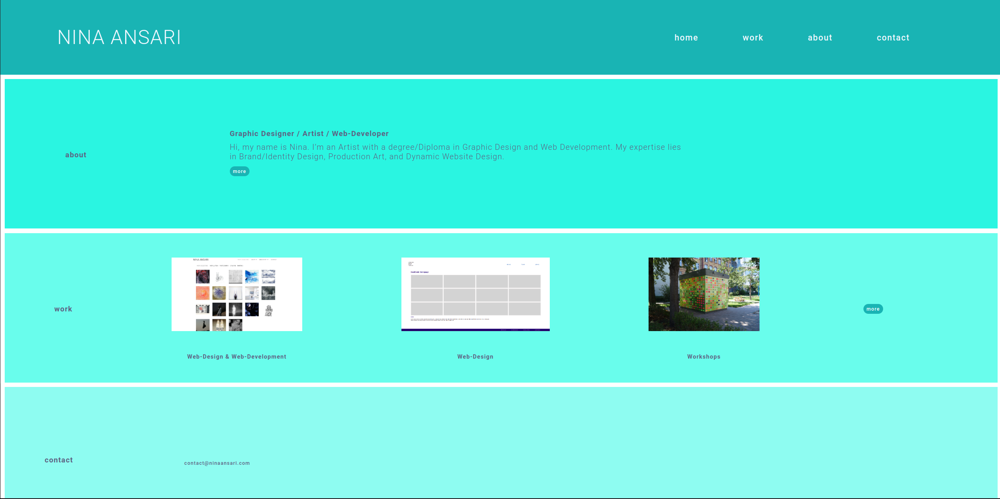

# Portfoliopage

Das ist mein Porfolio Homepage Projekt für die DCI. Diese Porfolioseite möchte ich auch gerne in Zukunft benutzen. Sie dient dazu mein Netzwerk weiter aufzubauen und meine neue Projekte als Web-Designer sichtbarer zu machen. 

## Workflow

Ich habe mir überlegt, wie ich dem user, Arbeitgeber oder Auftraggeber einen einfach und schnellen Einblick in meine bisheringen Projekte geben kann. 

### Wireframe 
wireframe Ansichten für mobile- und desktop wurden mit Figma erstellt.

### Farbpalette und Schriftwahl
 
 Vier helle Farben im blau-grün habe ich gewählt, weil diese eine fröhliche und beruhigende Wirkug auf den Betrachter haben.

 Die Schriftfarbe ist ein blaugrau, das mit der Farbpallete daher gut hamoniert. Roboto wurde als Schrift wegen ihrer guten Leserlichkeit gewählt.

### Code schreiben
Angefangen habe ich mit einer groben klassischen html-Struktur. Parallel diese Bereiche mit css grob gestaltet. Erste Media Query programmiert. Anschliessend habe ich alle verlinkungen und Ordnerstrukturen der Seiten festgelegt. Zum Ende bin ich auf die Feinheiten der Gestaltung eingegangen und habe mit einem hover Effekt gearbeitet, um einzelne Abschnitte hervorzuheben.

## Fragen 
### Was ist mir besonders gelungen?

Mein Konzept umzusetzen und neues zu Lernen, wie z.B. css Datein in eine eigne Stuktur einzubauen oder eine Markdown Datei zu schreiben.

### Was fiel mir schwer?
Über mich selbst einen Text zu verfassen. Bei programmieren ergaben sich Probleme, die nur durch eine Überarbeitung beheben werden konnten. Dies hat sehr viel Zeit beansprucht. 

### Wie würde ich die Seite erweitern?

Mehr Projekte einbeziehen. Mehr Fähigkeiten / Softskills aufzählen.

# screenshot homepage 

